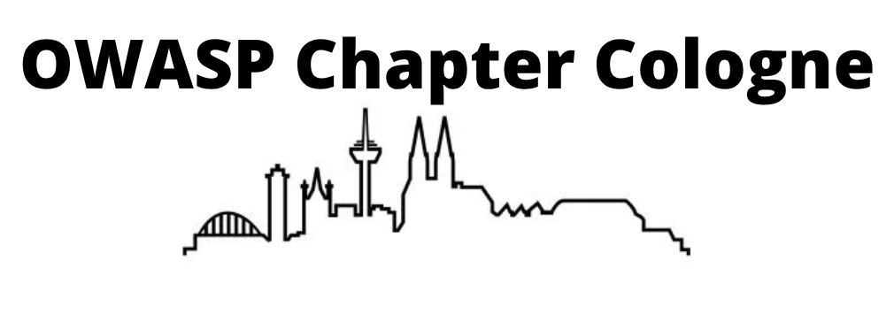

---

layout: col-sidebar
title: OWASP Cologne
tags: Cologne Köln 
region: Europe
country: Germany
meetup-group: tbd
postal-code: 50670

---
## Welcome

## Next Event

## 47. Cologne OWASP Stammtisch  2025-07-24

Our next Stammtisch will be focused on Authentication. First up there will be a talk from Daniel Fett.  The talk will be followed by the opportunity to share your authentication war stories. You can simply bring your story on the evening, or if you want to register in advance please get in touch with one of the leaders (links in the sidebar).

The event will be held at Startplatz, Im Mediapark 5, 50670 Köln and we will start at 7pm.  Room - Rome, 1st floor

### The Evolving Threat Landscape of OAuth: Securing the Backbone of Modern Authentication - Daniel Fett

OAuth 2.0 is everywhere. It’s the foundation of secure delegated access on the web, powering everything from social logins to financial APIs and identity verification systems. It enables seamless user experiences and federated authentication through OpenID Connect, while also playing a growing role in emerging technologies like digital wallets. But with great adoption comes great responsibility—and, unfortunately, great risk.
 
OAuth wasn’t originally designed for the high-stakes environments it now protects. Today, it's securing billions of transactions, yet many implementations still contain critical vulnerabilities. Outdated practices, subtle misconfigurations, and new attack vectors continue to put users and organizations at risk. The good news? The IETF and the OpenID Foundation are taking action. New standards introduce essential updates to strengthen OAuth and OpenID Connect security, deprecating insecure options and addressing modern threats.
 
In this talk, Daniel will explore the evolving security challenges of OAuth, dissect real-world attack scenarios, and break down the most crucial updates delivered by recently released specifications. Whether you're an architect, developer, or security leader, you’ll leave with a clear understanding of what’s changing, what’s at stake, and what you must do to keep your OAuth implementations secure.

## About Us

The OWASP Cologne Chapter is an open and inclusive community focused on application security. For several years, we have gathered as a Stammtisch, meeting regularly to discuss security topics, share knowledge, and connect with others interested in software security. Now, as an official OWASP chapter, we continue this tradition while expanding our discussions and engagement within the local security community.

Cologne has a thriving tech scene, with a strong mix of startups, established companies, and research institutions. Our chapter provides a welcoming space for developers, security professionals, students, and researchers to exchange knowledge, stay updated on security trends, and strengthen application security practices.

We meet on the third Thursday of every second month (the exact dates are below), at [Startplatz](https://www.startplatz.de/) in Köln.  

## Get Involved

OWASP is open to everyone, regardless of background or experience level. You can:

* Attend our meetups to participate in discussions and learn about application security.

* Share your knowledge by giving a talk or presenting on a topic.

* Help grow the chapter by contributing ideas or assisting in organizing events.

## Participation
The Open Worldwide Application Security Project (OWASP) is a nonprofit foundation that works to improve the security of software. All of our projects, tools, documents, forums, and chapters are free and open to anyone interested in improving application security. 

Chapters are led by local leaders in accordance with the [Chapters Policy](/www-policy/operational/chapters). Financial contributions should only be made online using the authorized online donation button. 

Everyone is welcome and encouraged to participate. We especially encourage diversity in all our initiatives. OWASP is a fantastic place to learn about application security, to network, and even to build your reputation as an expert. 

## Upcoming Events 2025

* July 24, 2025: Authentication

* September 18, 2025: Topic to be announced.

* November 27, 2025: Topic to be announced.

<!--
## Next Meeting/Event
---------------------





-->