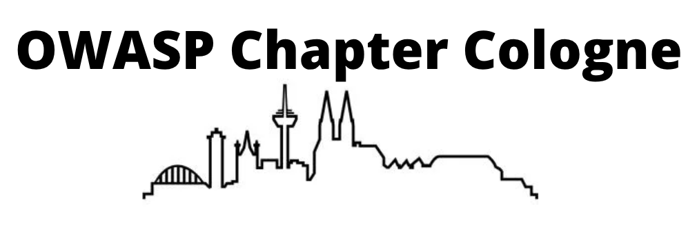

---

layout: col-sidebar
title: OWASP Cologne
tags: Cologne Köln 
region: Europe
country: Germany
meetup-group: tbd
postal-code: 50670

---
## Welcome

## 51. Cologne OWASP Stammtisch  2026.03.26 - REWE Digital, Schanzenstr. 6-20, Kupferwerk 2.20, 1 OG, Köln
Event starts at 19:00, the talk will begin at 19:30

### Why IAM Remains a Challenge and What We Can Do About It - Dimitrij Drus

Everyone expects Identity & Access Management to be a "set it and forget it" problem. But the reality looks quite different: the same challenges keep resurfacing, they are technically demanding, time-consuming, and frequently create friction between teams, ultimately resulting in significant costs. And the rise of AI agents makes it even worse.
 
Over the years, Dimitrij explored these recurring issues, which led to a multi part blog series (https://www.innoq.com/en/blog/2025/07/whats-wrong-with-the-current-owasp-microservice-security-cheat-sheet/) published in 2025, initially aimed at updating the OWASP Microservice Security Cheat Sheet. His goal was to show how well known IAM building blocks can be combined into pragmatic, coherent, and operationally realistic solutions. That work eventually grew beyond the original scope and is extending to multiple new OWASP Cheat Sheets plus an entirely new architectural-level cheat sheet format.
 
In this talk Dimitrij will share the essence of the patterns and the strategies he identified and documented, show how to avoid the usual traps, and how to reduce IAM complexity in distributed systems to create the space to focus on what is actually being built - the product.

This talk is aimed at developers, architects, and security practitioners working with distributed systems. It provides an overview of actually known IAM patterns that are however often unfamiliar in real-world projects.

## Upcoming Events 2026

* May 21
* September 17
* November 19

## About Us

The OWASP Cologne Chapter is an open and inclusive community focused on application security. For several years, we have gathered as a Stammtisch, meeting regularly to discuss security topics, share knowledge, and connect with others interested in software security. Now, as an official OWASP chapter, we continue this tradition while expanding our discussions and engagement within the local security community.

Cologne has a thriving tech scene, with a strong mix of startups, established companies, and research institutions. Our chapter provides a welcoming space for developers, security professionals, students, and researchers to exchange knowledge, stay updated on security trends, and strengthen application security practices.

We meet on the third Thursday of every second month (the exact dates are below), at [Startplatz](https://www.startplatz.de/) in Köln.  

## Get Involved

OWASP is open to everyone, regardless of background or experience level. You can:

* Attend our meetups to participate in discussions and learn about application security.

* Share your knowledge by giving a talk or presenting on a topic.

* Help grow the chapter by contributing ideas or assisting in organizing events.

## Participation
The Open Worldwide Application Security Project (OWASP) is a nonprofit foundation that works to improve the security of software. All of our projects, tools, documents, forums, and chapters are free and open to anyone interested in improving application security. 

Chapters are led by local leaders in accordance with the [Chapters Policy](/www-policy/operational/chapters). Financial contributions should only be made online using the authorized online donation button. 

Everyone is welcome and encouraged to participate. We especially encourage diversity in all our initiatives. OWASP is a fantastic place to learn about application security, to network, and even to build your reputation as an expert. 

<!--
## Next Meeting/Event
---------------------






-->
